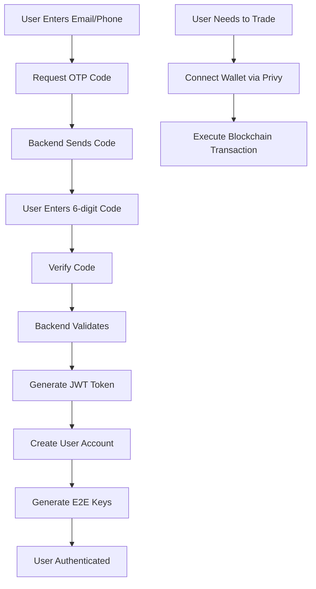

# Authentication Guide

The Loopz SDK uses a custom OTP (One-Time Password) authentication system for accessing the application. This is separate from blockchain wallet connections, which are handled later only when needed for on-chain transactions.

## Overview

The Loopz authentication system:

- Uses email or SMS-based OTP verification
- Does NOT require wallet connection for basic access
- Manages user sessions with JWT tokens
- Stores encrypted user data locally
- Generates E2E encryption keys for secure chat

## Authentication Architecture



## Email Authentication Flow

### Step 1: Initialize Authentication

The authentication UI is managed by the `LoopzAuth` component which is automatically included when using `LoopzProvider`:

```tsx
import { LoopzProvider } from "@salad-labs/loopz-typescript"

function App() {
  const loopzConfig = {
    apiKey: process.env.NEXT_PUBLIC_LOOPZ_API_KEY!,
    privyAppId: process.env.NEXT_PUBLIC_PRIVY_APP_ID!, // For future blockchain ops
    privyClientConfig: {
      // Privy config for when blockchain is needed
    },
    intl: {
      // Customizable text for auth UI
      titleApp: "My Trading App",
      emailAddressFieldLabel: "Email Address",
      buttonSendVerificationLabel: "Send Code",
      stepVerificationCodeLabel: "Enter Code",
      successRequestOtpCode: "Code sent successfully!",
      authSuccess: "Welcome back!",
    },
    logoURL: "https://your-app.com/logo.png",
    tosURL: "https://your-app.com/terms",
    privacyURL: "https://your-app.com/privacy",
  }

  return (
    <LoopzProvider config={loopzConfig}>
      <YourApp />
    </LoopzProvider>
  )
}
```

### Step 2: Trigger Authentication

```tsx
import { useLoopzAuth } from "@salad-labs/loopz-typescript"

function LoginButton() {
  const { authenticate, isAuthenticated, account } = useLoopzAuth()

  const handleLogin = async () => {
    try {
      // This opens the OTP modal
      const { auth, account } = await authenticate()

      console.log("Logged in user:", account.email)
      console.log("User DID:", account.did)
      console.log("JWT Token stored")
    } catch (error) {
      if (error.error === "user_exit_auth_flow") {
        console.log("User closed the auth modal")
      } else {
        console.error("Authentication failed:", error)
      }
    }
  }

  if (isAuthenticated) {
    return <div>Welcome, {account?.email}</div>
  }

  return <button onClick={handleLogin}>Login with Email</button>
}
```

### Step 3: Authentication Modal Flow

When `authenticate()` is called:

1. **Email Input**: User enters their email address
2. **Send OTP**: Backend sends a 6-digit code via email
3. **Code Verification**: User enters the code
4. **Success**: JWT token is stored, user is authenticated

The entire flow is handled by the built-in UI component.

## Phone/SMS Authentication

For SMS authentication, you need to implement custom handlers:

```tsx
function PhoneAuthExample() {
  const { sendPhoneOTPCode, authenticate } = useLoopzAuth()
  const [phone, setPhone] = useState("")

  // Note: The current SDK expects these handlers to be provided
  // via LoopzAuthProvider configuration

  return (
    <LoopzProvider
      config={loopzConfig}
      authConfig={{
        onSendPhoneOTPCode: async (phone: string) => {
          // Implement your SMS sending logic
          const response = await fetch("/api/send-sms", {
            method: "POST",
            body: JSON.stringify({ phone }),
          })
          return response.json()
        },
        onSendPhoneOTPCodeAfterAuth: async (phone: string) => {
          // For adding phone after initial auth
        },
      }}
    >
      <YourApp />
    </LoopzProvider>
  )
}
```

## Session Management

### Automatic Session Persistence

Sessions are automatically restored on page refresh:

```tsx
function App() {
  const { isAuthenticated, isLoading, account } = useLoopzAuth()

  useEffect(() => {
    if (!isLoading && isAuthenticated) {
      console.log("Session restored for:", account?.email)
    }
  }, [isLoading, isAuthenticated])

  if (isLoading) {
    return <div>Checking authentication...</div>
  }

  return isAuthenticated ? <AuthenticatedApp /> : <LoginScreen />
}
```

### Manual Session Check

```tsx
import { Auth } from "@salad-labs/loopz-typescript"

// Check if user is authenticated
const auth = Auth.getInstance()
const isAuthenticated = auth.isAuthenticated()
const account = auth.getCurrentAccount()
```

### Logout

```tsx
function LogoutButton() {
  const { logout } = useLoopzAuth()

  const handleLogout = async () => {
    await logout()
    // This will:
    // - Clear JWT tokens
    // - Remove local user data
    // - Disconnect chat
    // - Reset authentication state
  }

  return <button onClick={handleLogout}>Logout</button>
}
```

## Account Information

After authentication, you can access user information:

```tsx
function UserProfile() {
  const { account } = useLoopzAuth()

  if (!account) return null

  return (
    <div>
      <p>Email: {account.email}</p>
      <p>User ID: {account.did}</p>
      <p>Username: {account.username || "Not set"}</p>
      <p>First Login: {account.firstLogin ? "Yes" : "No"}</p>
      <p>Profile Complete: {account.signupCompleted ? "Yes" : "No"}</p>

      {/* E2E Encryption Status */}
      <p>Can Use Chat: {account.e2ePublicKey ? "Yes" : "No"}</p>
    </div>
  )
}
```

## Post-Authentication Setup

### Profile Completion

Check if the user needs to complete their profile:

```tsx
function useProfileCompletion() {
  const { account, isAuthenticated } = useLoopzAuth()
  const navigate = useNavigate()

  useEffect(() => {
    if (isAuthenticated && account) {
      if (!account.signupCompleted || !account.username) {
        navigate("/complete-profile")
      }
    }
  }, [isAuthenticated, account])
}
```

### Update User Profile

```tsx
async function updateProfile() {
  const { account } = useLoopzAuth()

  try {
    await account?.updateData({
      username: "CoolTrader123",
      bio: "NFT enthusiast",
      avatarFile: avatarFile, // File object
      city: "New York",
      country: "USA",
      signupCompleted: true,
    })

    console.log("Profile updated successfully")
  } catch (error) {
    console.error("Profile update failed:", error)
  }
}
```

## Blockchain Authentication (When Needed)

Wallet connection via Privy is only required when performing blockchain operations:

```tsx
function CreateOrder() {
  const { account } = useLoopzAuth()
  const { instance } = useLoopz()

  const handleCreateOrder = async () => {
    try {
      // This is when Privy comes into play
      // The SDK will automatically prompt for wallet connection
      const wallet = await account?.getActiveWallets()[0]

      if (!wallet) {
        // Privy modal will appear to connect wallet
        console.log("Please connect your wallet")
        return
      }

      // Now you can create orders
      const order = await instance.order.create(
        wallet
        // ... order parameters
      )
    } catch (error) {
      console.error("Order creation failed:", error)
    }
  }

  return (
    <button onClick={handleCreateOrder}>Create Order (Requires Wallet)</button>
  )
}
```

## Authentication Events

Listen to authentication events:

```tsx
useEffect(() => {
  const auth = Auth.getInstance()

  // Authentication successful
  auth.on("auth", () => {
    console.log("User authenticated successfully")
  })

  // Authentication error
  auth.on("onAuthError", (error) => {
    console.error("Authentication error:", error)
  })

  // User logged out
  auth.on("logout", () => {
    console.log("User logged out")
    // Clean up user data
  })

  // Cleanup
  return () => {
    auth.off("auth")
    auth.off("onAuthError")
    auth.off("logout")
  }
}, [])
```

## Customizing Authentication UI

### Custom Translations

```tsx
const customIntl = {
  titleApp: 'Welcome to NFT Trader',
  emailAddressFieldLabel: 'Your Email',
  buttonSendVerificationLabel: 'Get Access Code',
  stepVerificationCodeLabel: 'Verify Your Code',
  stepVerificationCodeDescriptionLabel: 'Check your email for a 6-digit code',
  sixDigitDescriptionLabel: 'Enter the code sent to',
  backLabel: 'Go Back',
  buttonVerifyingCodeLabel: 'Verifying...',
  buttonVerifyCodeLabel: 'Confirm Code',
  resendVerificationCodeLabel: 'Send New Code',
  successRequestOtpCode: 'Code sent! Check your email',
  authSuccess: 'Welcome aboard!',
  failedSendRequestOtpCode: 'Could not send code. Try again.',
  invalidOtpCode: 'Invalid code. Please check and try again.',
  networkError: 'Connection issue. Please try again.'
}

<LoopzProvider
  config={{
    ...config,
    intl: customIntl
  }}
>
```

### Referral Codes

The SDK automatically detects referral codes from URL parameters:

```
https://your-app.com?code=REFER123
```

This referral code will be included in the authentication process.

## Security Considerations

1. **JWT Token Storage**: Tokens are stored in localStorage with automatic expiration
2. **Token Refresh**: Tokens are automatically refreshed before expiration
3. **E2E Encryption**: Chat keys are generated after authentication
4. **Session Security**: Sessions expire after 18 hours of inactivity
5. **OTP Security**: Codes expire after 5 minutes

## Troubleshooting

### Common Issues

1. **"Network error" during OTP request**

   - Check your API key configuration
   - Ensure backend is accessible
   - Verify CORS settings

2. **"Invalid code" error**

   - Codes expire after 5 minutes
   - Ensure you're entering the latest code
   - Check for typos in the 6-digit code

3. **Session not persisting**

   - Check if localStorage is enabled
   - Verify token is not expired
   - Check for localStorage clearing

4. **Wallet connection issues**
   - These only occur during blockchain operations
   - Ensure Privy is properly configured
   - Check wallet extension is installed

## Next Steps

- Explore [Chat Features](./chat.md) for encrypted messaging
- Learn about [Trading](./trading.md) (requires wallet connection)
