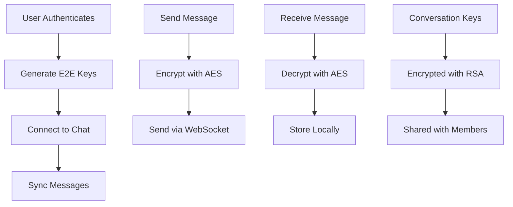

# Chat Guide

The Loopz SDK provides a comprehensive encrypted chat system designed specifically for trading contexts. All messages are end-to-end encrypted using a hybrid RSA/AES encryption scheme.

## Overview

Key features of the chat system:

- **End-to-End Encryption**: All messages encrypted with RSA + AES
- **Real-time Messaging**: WebSocket-based for instant delivery
- **Trade Context**: Special message types for proposals and NFT sharing
- **Offline Support**: Local storage with Dexie for offline access
- **Group Chats**: Support for multi-party trading discussions
- **Message Types**: Text, attachments, trade proposals, NFT sharing

## Architecture



## Initialization

### Step 1: Connect to Chat

After authentication, connect to the chat system:

```typescript
import { useLoopzChat } from "@salad-labs/loopz-typescript"

function ChatConnection() {
  const { connect, disconnect, isConnected, isConnecting, canChat } =
    useLoopzChat()

  useEffect(() => {
    const initChat = async () => {
      if (canChat && !isConnected) {
        try {
          await connect()
          console.log("Chat connected")
        } catch (error) {
          console.error("Chat connection failed:", error)
        }
      }
    }

    initChat()

    // Cleanup on unmount
    return () => {
      if (isConnected) {
        disconnect()
      }
    }
  }, [canChat, isConnected])

  if (!canChat) {
    return <div>Setting up encryption keys...</div>
  }

  return <div>Status: {isConnected ? "Connected" : "Disconnected"}</div>
}
```

### Step 2: Sync Messages

Sync retrieves historical messages and sets up real-time listeners:

```typescript
function ChatSync() {
  const { sync, isSynced, isSyncing } = useLoopzChat({
    // Event handlers
    onSync: () => {
      console.log("Sync completed")
    },
    onSyncError: (error) => {
      console.error("Sync failed:", error)
    },
    onSyncUpdate: (progress) => {
      console.log("Sync progress:", progress)
    },
  })

  useEffect(() => {
    const startSync = async () => {
      if (!isSynced && !isSyncing) {
        await sync()
      }
    }

    startSync()
  }, [])

  return <div>Sync Status: {isSynced ? "Synced" : "Syncing..."}</div>
}
```

## Conversations

### Creating a Conversation

```typescript
import { useLoopz } from "@salad-labs/loopz-typescript"
import { Crypto } from "@salad-labs/loopz-typescript"

function CreateConversation() {
  const { instance } = useLoopz()

  const createPrivateChat = async (recipientDid: string) => {
    try {
      // Generate conversation encryption keys
      const conversationAESKey = Crypto.generateBase64Key_AES256()
      const conversationIVKey = Crypto.generateBase64IV_128Bit()

      // Create conversation
      const result = await instance.chat.createConversation({
        name: "Trade Discussion",
        description: "Discussing NFT trade",
        type: "PRIVATE",
        conversationKeys: {
          conversationAESKey,
          conversationIVKey,
        },
      })

      // Add recipient
      await instance.chat.joinMembersToConversation({
        conversationId: result.conversationId,
        members: [
          {
            userId: recipientDid,
            encryptedConversationAESKey: "encrypted_key", // Encrypt with recipient's public key
            encryptedConversationIVKey: "encrypted_iv",
          },
        ],
      })

      console.log("Conversation created:", result.conversationId)
      return result
    } catch (error) {
      console.error("Failed to create conversation:", error)
    }
  }

  return (
    <button onClick={() => createPrivateChat("recipient-did")}>
      Start Chat
    </button>
  )
}
```

### Getting Conversations

```typescript
function ConversationsList() {
  const { instance } = useLoopz()
  const [conversations, setConversations] = useState([])

  useEffect(() => {
    const loadConversations = async () => {
      try {
        const convs = await instance.chat.getConversations()
        setConversations(convs)
      } catch (error) {
        console.error("Failed to load conversations:", error)
      }
    }

    loadConversations()
  }, [])

  return (
    <div>
      {conversations.map((conv) => (
        <div key={conv.id}>
          <h3>{conv.name}</h3>
          <p>{conv.description}</p>
          <p>Type: {conv.type}</p>
          <p>Members: {conv.membersIds?.length || 0}</p>
        </div>
      ))}
    </div>
  )
}
```

## Messaging

### Sending Text Messages

```typescript
function MessageComposer({ conversationId }) {
  const { instance } = useLoopz()
  const [message, setMessage] = useState("")

  const sendMessage = async () => {
    if (!message.trim()) return

    try {
      const sent = await instance.chat.sendMessage({
        conversationId,
        content: message,
        type: MessageType.Textual,
      })

      console.log("Message sent:", sent.id)
      setMessage("")
    } catch (error) {
      console.error("Failed to send message:", error)
    }
  }

  return (
    <div>
      <input
        value={message}
        onChange={(e) => setMessage(e.target.value)}
        placeholder="Type a message..."
      />
      <button onClick={sendMessage}>Send</button>
    </div>
  )
}
```

### Sending Trade Proposals

```typescript
import { MessageType } from "@salad-labs/loopz-typescript"

function TradeProposalMessage({ conversationId }) {
  const { instance } = useLoopz()

  const sendTradeProposal = async () => {
    try {
      const proposal = {
        assets: {
          offered: [
            {
              token: "0x...", // NFT contract
              tokenId: "123",
              amount: "1",
              type: "ERC721",
            },
          ],
          wanted: [
            {
              token: "0x...", // Token contract
              amount: "1000000000000000000", // 1 ETH
              type: "ERC20",
            },
          ],
        },
        message: "I would like to trade this NFT for 1 ETH",
      }

      const sent = await instance.chat.sendMessage({
        conversationId,
        content: proposal,
        type: MessageType.TradeProposal,
      })

      console.log("Trade proposal sent:", sent.id)
    } catch (error) {
      console.error("Failed to send proposal:", error)
    }
  }

  return <button onClick={sendTradeProposal}>Send Trade Proposal</button>
}
```

### Loading Messages

```typescript
function MessagesList({ conversationId }) {
  const { instance } = useLoopz()
  const [messages, setMessages] = useState([])
  const [loading, setLoading] = useState(true)

  useEffect(() => {
    const loadMessages = async () => {
      try {
        const msgs = await instance.chat.getMessages(conversationId, {
          skip: 0,
          take: 50,
        })

        setMessages(msgs)
      } catch (error) {
        console.error("Failed to load messages:", error)
      } finally {
        setLoading(false)
      }
    }

    loadMessages()
  }, [conversationId])

  if (loading) return <div>Loading messages...</div>

  return (
    <div>
      {messages.map((msg) => (
        <MessageItem key={msg.id} message={msg} />
      ))}
    </div>
  )
}

function MessageItem({ message }) {
  const { account } = useLoopzAuth()
  const isOwn = message.userId === account?.dynamoDBUserID

  return (
    <div className={isOwn ? "sent" : "received"}>
      <p>{message.user.username}</p>
      <p>{message.content}</p>
      <p>{new Date(message.createdAt).toLocaleString()}</p>

      {message.type === "TRADE_PROPOSAL" && (
        <TradeProposalView proposal={message.content} />
      )}
    </div>
  )
}
```

## Real-time Events

### Message Events

```typescript
function ChatWithRealtime() {
  const { instance } = useLoopz()
  const [messages, setMessages] = useState([])

  const { isConnected } = useLoopzChat({
    // New message received
    onMessageReceived: (message) => {
      console.log("New message:", message)
      setMessages((prev) => [...prev, message])
    },

    // Message updated (edited)
    onMessageUpdated: (message) => {
      setMessages((prev) =>
        prev.map((m) => (m.id === message.id ? message : m))
      )
    },

    // Message deleted
    onMessageDeleted: (messageId) => {
      setMessages((prev) => prev.filter((m) => m.id !== messageId))
    },

    // Reaction added
    onReactionAdded: ({ messageId, reaction }) => {
      console.log("Reaction added to message:", messageId)
    },
  })

  return <MessagesList messages={messages} />
}
```

### Conversation Events

```typescript
const {} = useLoopzChat({
  // New conversation created
  onConversationCreated: (conversation) => {
    console.log("New conversation:", conversation)
  },

  // Conversation updated
  onConversationUpdated: (conversation) => {
    console.log("Conversation updated:", conversation)
  },

  // Added to conversation
  onConversationNewMembers: ({ conversationId, members }) => {
    console.log("New members added:", members)
  },

  // Conversation muted/unmuted
  onConversationMuted: (conversationId) => {
    console.log("Conversation muted:", conversationId)
  },
})
```

## Encryption Details

### How E2E Encryption Works

1. **User Keys**: Each user has an RSA key pair (4096-bit)
2. **Conversation Keys**: Each conversation has AES-256 + IV keys
3. **Key Distribution**: AES keys encrypted with each member's RSA public key
4. **Message Encryption**: All messages encrypted with conversation's AES keys

```typescript
// Example: Manual encryption (SDK handles this automatically)
import { Crypto } from "@salad-labs/loopz-typescript"

// Generate conversation keys
const aesKey = Crypto.generateBase64Key_AES256()
const ivKey = Crypto.generateBase64IV_128Bit()

// Encrypt message
const encrypted = Crypto.encryptAES_CBC(
  "Hello, this is encrypted!",
  aesKey,
  ivKey
)

// Decrypt message
const decrypted = Crypto.decryptAES_CBC(encrypted, aesKey, ivKey)
```

## Advanced Features

### Message Reactions

```typescript
// Add reaction
await instance.chat.addReactionToMessage({
  messageId: "message-id",
  conversationId: "conversation-id",
  reaction: "👍",
})

// Remove reaction
await instance.chat.removeReactionFromMessage({
  messageId: "message-id",
  conversationId: "conversation-id",
  reaction: "👍",
})
```

### Muting Conversations

```typescript
// Mute conversation
await conversation.muteConversation({ duration: 3600 }) // 1 hour

// Unmute
await conversation.unmuteConversation()
```

### Typing Indicators

```typescript
// Note: Implement with custom solution
// The SDK doesn't have built-in typing indicators
```

### Message Search

```typescript
// Search messages locally
const results = await instance.chat.searchMessages({
  query: "NFT trade",
  conversationId: "optional-filter",
  limit: 20,
})
```

## Best Practices

### 1. Connection Management

```typescript
// Always check connection status
if (!isConnected) {
  await connect()
}

// Handle reconnections
window.addEventListener("online", () => {
  if (!isConnected) {
    reconnect()
  }
})
```

### 2. Message Pagination

```typescript
const loadMoreMessages = async (lastMessageId) => {
  const older = await instance.chat.getMessages(conversationId, {
    before: lastMessageId,
    limit: 20,
  })

  setMessages((prev) => [...older, ...prev])
}
```

### 3. Error Handling

```typescript
try {
  await sendMessage(content)
} catch (error) {
  if (error.message.includes("not connected")) {
    await reconnect()
    await sendMessage(content) // Retry
  }
}
```

### 4. Optimistic Updates

```typescript
// Show message immediately, update when confirmed
const optimisticMessage = {
  id: "temp-" + Date.now(),
  content,
  status: "sending",
}

setMessages((prev) => [...prev, optimisticMessage])

try {
  const sent = await sendMessage(content)
  // Replace optimistic message with real one
  setMessages((prev) =>
    prev.map((m) => (m.id === optimisticMessage.id ? sent : m))
  )
} catch (error) {
  // Mark as failed
  setMessages((prev) =>
    prev.map((m) =>
      m.id === optimisticMessage.id ? { ...m, status: "failed" } : m
    )
  )
}
```

## Security Considerations

1. **Key Storage**: Private keys are encrypted and stored locally
2. **Key Rotation**: Not currently supported - keys are permanent
3. **Forward Secrecy**: Not implemented - consider for sensitive discussions
4. **Message Retention**: Messages stored indefinitely unless manually deleted
5. **Metadata**: Message metadata (sender, timestamp) not encrypted

## Troubleshooting

### "Cannot connect" Error

- Check if user is authenticated
- Verify E2E keys are generated (`canChat` should be true)
- Check network connectivity

### "Cannot decrypt message" Error

- User may have lost their private key
- Conversation keys may be corrupted
- Try rejoining the conversation

### Messages Not Syncing

- Ensure `sync()` was called after connection
- Check if storage is enabled
- Verify WebSocket connection is stable

### Performance Issues

- Limit message history loaded
- Implement virtual scrolling for large conversations
- Use pagination for message lists

## Next Steps

- Explore [Trading Features](./trading.md) for trade proposals
- Check [Use Cases](../use-cases.md) for real-world examples
