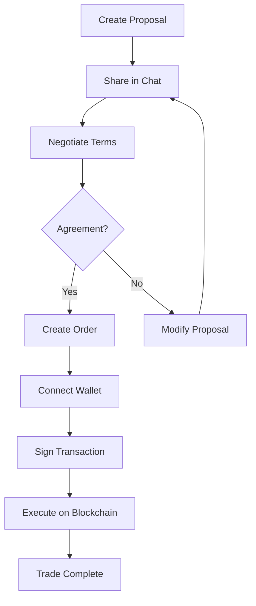

# Trading Guide

The Loopz SDK provides a comprehensive trading system built on OpenSea's Seaport protocol, enabling peer-to-peer NFT and token trading with integrated chat functionality.

## Overview

The trading system consists of two main components:

1. **Proposals**: Off-chain trade offers that can be shared and negotiated
2. **Orders**: On-chain orders executed through Seaport smart contracts

## Architecture



## Trading Flow

### Step 1: Wallet Connection

Before creating orders, users must connect their wallet via Privy:

```typescript
import { useLoopzAuth, useLoopz } from "@salad-labs/loopz-typescript"

function TradingComponent() {
  const { account } = useLoopzAuth()
  const { instance } = useLoopz()

  const initializeTrading = async () => {
    try {
      // Get connected wallet
      const wallets = account?.getActiveWallets()
      if (!wallets || wallets.length === 0) {
        console.log("Please connect your wallet first")
        // This will trigger Privy wallet connection
        return
      }

      const wallet = wallets[0]

      // Initialize Order module with wallet
      await instance.order.init(wallet)

      console.log("Trading initialized with wallet:", wallet.address)
    } catch (error) {
      console.error("Failed to initialize trading:", error)
    }
  }

  return <button onClick={initializeTrading}>Start Trading</button>
}
```

### Step 2: Create a Trade Proposal

Proposals are off-chain trade offers that can be shared and discussed:

```typescript
import { Proposal, MessageMap } from "@salad-labs/loopz-typescript"

async function createTradeProposal() {
  const { instance } = useLoopz()
  const { account } = useLoopzAuth()

  try {
    const proposal = await instance.proposal.create(
      {
        type: Proposal.PROPOSAL_TYPE.TRADE, // Trading type
        networkId: "1", // Ethereum mainnet
        creatorAddress: account.wallet,
        expirationDate: Date.now() + 7 * 24 * 60 * 60 * 1000, // 7 days
        assets: {
          offered: [
            {
              token: "0x...", // NFT contract address
              tokenId: "123",
              amount: "1",
              itemType: "ERC721",
              name: "Cool NFT #123",
              resourceUrl: "https://...", // NFT image
            },
          ],
          wanted: [
            {
              token: "0x0000000000000000000000000000000000000000", // ETH
              amount: "1000000000000000000", // 1 ETH in wei
              itemType: "NATIVE",
              amountHumanReadable: "1 ETH",
            },
          ],
        },
        messages: [
          {
            type: MessageMap.MESSAGE_MATRIX["10"], // "This may be perfect for you"
          },
        ],
      },
      "signed_message_here" // Signature for proposal
    )

    console.log("Proposal created:", proposal)
    return proposal
  } catch (error) {
    console.error("Failed to create proposal:", error)
  }
}
```

### Step 3: Share Proposal in Chat

Share the proposal in a chat conversation:

```typescript
async function shareProposalInChat(proposalId: string) {
  const { instance } = useLoopz()

  try {
    // Get the proposal details
    const proposal = await instance.proposal.get(proposalId)

    // Create a message with the proposal
    const message = await instance.chat.createMessage({
      conversationId: "conversation_id_here",
      type: "TRADE_PROPOSAL",
      content: JSON.stringify({
        proposalId: proposal.id,
        message: "Check out my trade offer!",
        assets: proposal.assets,
      }),
    })

    console.log("Proposal shared in chat:", message)
  } catch (error) {
    console.error("Failed to share proposal:", error)
  }
}
```

### Step 4: Create an Order

Convert a proposal to an on-chain order using Seaport:

```typescript
async function createOrder() {
  const { instance } = useLoopz()
  const { account } = useLoopzAuth()

  try {
    // Ensure wallet is connected
    const wallet = account?.getActiveWallets()[0]
    if (!wallet) throw new Error("No wallet connected")

    // Initialize order module
    await instance.order.init(wallet)

    // Create order
    const order = await instance.order.create(
      wallet,
      {
        // Maker (seller) assets
        address: account.wallet,
        assets: [
          {
            token: "0x...", // NFT contract
            identifier: "123", // Token ID
            amount: "1",
            itemType: "ERC721",
          },
        ],
      },
      {
        // Taker (buyer) assets
        address: "", // Empty = any taker
        assets: [
          {
            token: "0x0000000000000000000000000000000000000000",
            amount: "1000000000000000000", // 1 ETH
            itemType: "NATIVE",
          },
        ],
      },
      7, // Expiration in days
      [], // Additional fees (optional)
      proposalId // Link to proposal (optional)
    )

    console.log("Order created:", {
      orderId: order.orderId,
      orderHash: order.hash,
    })

    return order
  } catch (error) {
    console.error("Failed to create order:", error)
  }
}
```

### Step 5: Execute a Trade

Complete a trade by fulfilling an existing order:

```typescript
async function executeTrade(orderId: string) {
  const { instance } = useLoopz()

  try {
    // Listen to order events
    instance.order.on("onFulfillOrder", () => {
      console.log("Order being fulfilled...")
    })

    instance.order.on("onExecuteAllActions", ({ transact }) => {
      console.log("Transaction submitted:", transact.hash)
    })

    instance.order.on("onFinalizeError", ({ error }) => {
      console.error("Trade failed:", error)
    })

    // Execute the trade
    await instance.order.finalize(orderId)

    console.log("Trade executed successfully!")
  } catch (error) {
    console.error("Failed to execute trade:", error)
  }
}
```

## Asset Types

The SDK supports various asset types:

```typescript
// NFT (ERC721)
const nftAsset = {
  token: "0x...", // Contract address
  identifier: "123", // Token ID
  amount: "1",
  itemType: "ERC721",
  name: "My NFT",
  resourceUrl: "https://...",
}

// Semi-fungible Token (ERC1155)
const erc1155Asset = {
  token: "0x...",
  identifier: "456",
  amount: "5", // Can trade multiple
  itemType: "ERC1155",
}

// Fungible Token (ERC20)
const tokenAsset = {
  token: "0x...", // Token contract
  amount: "1000000", // Amount in smallest unit
  itemType: "ERC20",
  symbol: "USDC",
}

// Native Currency (ETH)
const ethAsset = {
  token: "0x0000000000000000000000000000000000000000",
  amount: "1000000000000000000", // 1 ETH in wei
  itemType: "NATIVE",
}
```

## Complex Trades

### Multi-Asset Trades

Trade multiple assets in a single transaction:

```typescript
const complexOrder = await instance.order.create(
  wallet,
  {
    address: makerAddress,
    assets: [
      // Offering 2 NFTs
      {
        token: "0xNFT1...",
        identifier: "100",
        amount: "1",
        itemType: "ERC721",
      },
      {
        token: "0xNFT2...",
        identifier: "200",
        amount: "1",
        itemType: "ERC721",
      },
    ],
  },
  {
    address: "", // Any taker
    assets: [
      // Wanting 1 ETH + 1000 USDC
      {
        token: "0x0000000000000000000000000000000000000000",
        amount: "1000000000000000000", // 1 ETH
        itemType: "NATIVE",
      },
      {
        token: "0xUSDC...",
        amount: "1000000000", // 1000 USDC (6 decimals)
        itemType: "ERC20",
      },
    ],
  },
  7 // 7 days expiration
)
```

### Collection Offers

Create offers for any NFT from a collection:

```typescript
// Note: Collection-wide offers require additional backend logic
// The current SDK focuses on specific token trades
```

## Order Management

### List Orders

Get orders from the marketplace:

```typescript
async function getMarketOrders() {
  const { instance } = useLoopz()

  try {
    const response = await instance.order.listOrders({
      networkId: "1", // Ethereum mainnet
      status: "active", // Order status
      skip: 0,
      take: 20,
      // Optional filters
      collections: [{ address: "0x...", networkId: "1" }],
      order: {
        direction: "DESC",
        field: "createdAt",
      },
    })

    console.log("Active orders:", response?.orders)
    console.log("Total count:", response?.total)

    return response
  } catch (error) {
    console.error("Failed to fetch orders:", error)
  }
}
```

### Get User Orders

Fetch orders for a specific user:

```typescript
async function getUserOrders(userDid: string) {
  const { instance } = useLoopz()

  try {
    const response = await instance.order.listUserOrders({
      networkId: "1",
      did: userDid,
      status: "*", // All statuses
      skip: 0,
      take: 50,
    })

    return response?.orders || []
  } catch (error) {
    console.error("Failed to fetch user orders:", error)
  }
}
```

### Cancel Order

Cancel an active order:

```typescript
async function cancelOrder(orderId: string) {
  const { instance } = useLoopz()

  try {
    // Listen to cancellation events
    instance.order.on("onCancelOrders", ({ tx }) => {
      console.log("Cancelling order...")
    })

    instance.order.on("onCancelOrdersMined", ({ receipt }) => {
      console.log("Order cancelled:", receipt.transactionHash)
    })

    await instance.order.cancel(
      orderId,
      2000000, // Gas limit (optional)
      null // Gas price (optional)
    )

    console.log("Order cancelled successfully")
  } catch (error) {
    console.error("Failed to cancel order:", error)
  }
}
```

## Event Handling

Listen to order lifecycle events:

```typescript
function setupOrderEventListeners() {
  const { instance } = useLoopz()

  // Order creation events
  instance.order.on("onCreateOrder", (data) => {
    console.log("Creating order...", data)
  })

  // Order fulfillment events
  instance.order.on("onFulfillOrder", () => {
    console.log("Fulfilling order...")
  })

  instance.order.on("onExecuteAllActions", ({ transact }) => {
    console.log("Transaction hash:", transact.hash)
  })

  // Error events
  instance.order.on("onFinalizeError", ({ error, typeError }) => {
    console.error(`Error (${typeError}):`, error)
  })

  instance.order.on("onFulfillOrderError", ({ error }) => {
    console.error("Fulfillment error:", error)
  })

  // Cleanup
  return () => {
    instance.order.off("onCreateOrder")
    instance.order.off("onFulfillOrder")
    instance.order.off("onExecuteAllActions")
    instance.order.off("onFinalizeError")
    instance.order.off("onFulfillOrderError")
  }
}
```

## Trading Rules & Limitations

### Seaport Restrictions

1. **Maker Assets**: Cannot include ERC20 or NATIVE tokens

   - Only NFTs (ERC721/ERC1155) in the offer
   - Tokens can only be on the taker (buyer) side

2. **One Token Rule**: Only one party can include fungible tokens
   - Either maker OR taker can have ERC20/NATIVE
   - Not both in the same trade

```typescript
// ❌ Invalid: Token in maker assets
const invalidOrder = {
  maker: {
    assets: [
      {
        itemType: "ERC20", // Not allowed!
        token: "0x...",
      },
    ],
  },
}

// ✅ Valid: Token only in taker assets
const validOrder = {
  maker: {
    assets: [{ itemType: "ERC721" }], // NFTs only
  },
  taker: {
    assets: [{ itemType: "NATIVE" }], // Tokens allowed
  },
}
```

### Gas Optimization

Configure block confirmations for transactions:

```typescript
// Set custom confirmation blocks (default: 3)
instance.order.setBlocksNumberConfirmationRequired(6)

// Custom gas settings
await instance.order.cancel(orderId, 3000000, "50000000000") // 50 gwei
```

## Security Considerations

1. **Approval Management**: Always check token approvals before trading
2. **Order Validation**: Verify order parameters before execution
3. **Expiration Dates**: Set reasonable expiration times
4. **Fee Verification**: Understand platform and creator fees
5. **Network Confirmation**: Ensure correct network before transactions

## Integration with Chat

### Trade Negotiation Flow

```typescript
async function negotiateTrade(conversationId: string) {
  const { instance } = useLoopz()

  // 1. Create initial proposal
  const proposal = await createTradeProposal()

  // 2. Share in chat
  await instance.chat.createMessage({
    conversationId,
    type: "TRADE_PROPOSAL",
    content: JSON.stringify({
      proposalId: proposal.id,
      message: "Interested in this trade?",
      assets: proposal.assets,
    }),
  })

  // 3. Listen for responses
  instance.chat.on("messageReceived", async (message) => {
    if (message.type === "TRADE_PROPOSAL") {
      // Handle counter-proposal
      console.log("Counter-proposal received:", message)
    }
  })

  // 4. On agreement, create order
  // ... create order flow
}
```

## Best Practices

1. **Always Initialize**: Call `order.init(wallet)` before trading
2. **Handle Errors**: Implement comprehensive error handling
3. **Event Cleanup**: Remove event listeners when done
4. **User Feedback**: Show transaction status to users
5. **Price Validation**: Verify asset values before execution
6. **Network Checks**: Confirm correct blockchain network

## Troubleshooting

### Common Issues

1. **"init() must be called"**

   ```typescript
   // Always initialize first
   await instance.order.init(wallet)
   ```

2. **"Cannot add ERC20 token in maker assets"**

   - Move tokens to taker side
   - Maker can only offer NFTs

3. **"Account must be initialized"**

   - Ensure user is authenticated
   - Check `isAuthenticated` status

4. **Transaction Failures**
   - Check wallet balance
   - Verify token approvals
   - Ensure correct network

## Next Steps

- Explore [Chat Integration](./chat.md) for trade discussions
- Check [Use Cases](../use-cases.md) for real-world examples
